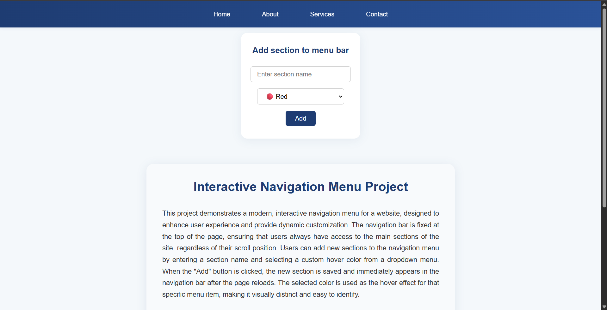
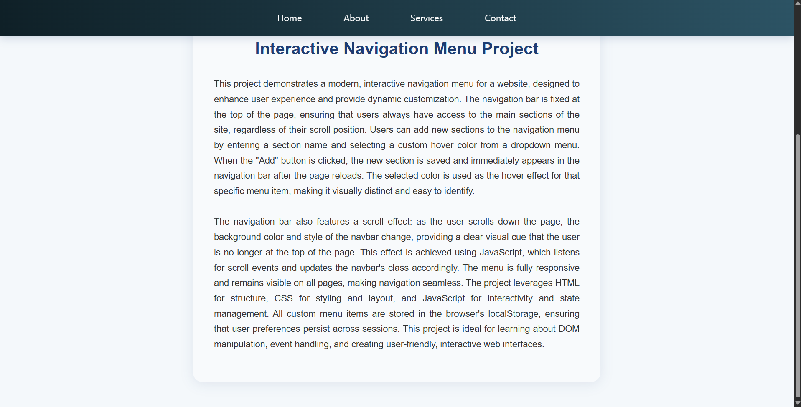
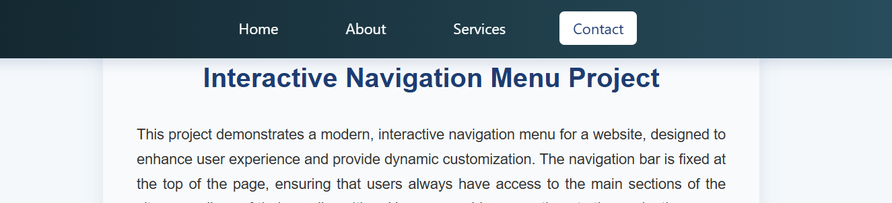
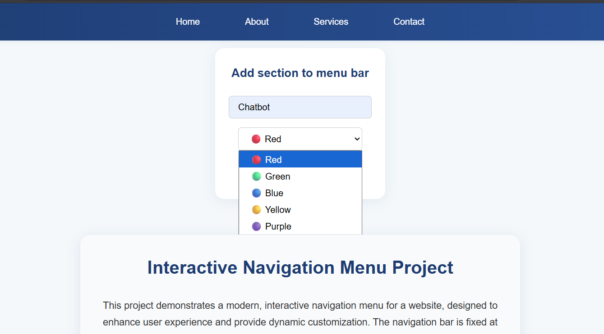
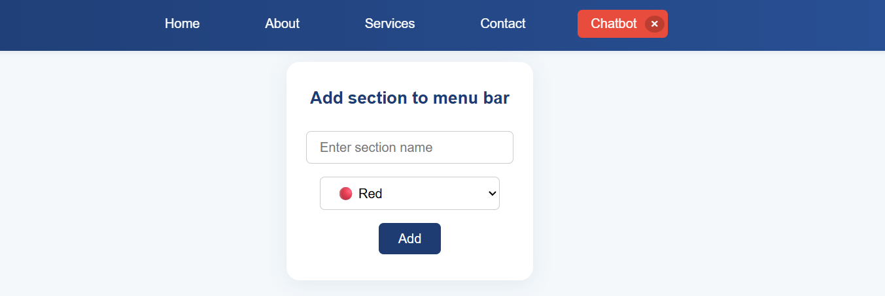
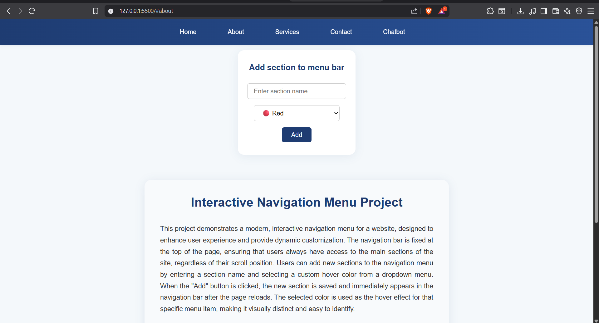

# PRODIGY_WD_01

  ##  Task Description
Create an interactive navigation menu that changes color or style when scrolled or when hovering over a menu item. The navigation menu should have a fixed position and be visible on all pages. Use HTML to structure the menu, CSS to style it, and JavaScript to add interactivity, such as changing the background color or font color of the menu when it is scrolled or when a menu item is hovered over.

## Additional Features & Changes
- Added a centered input card for adding new menu sections with a color dropdown and an "Add" button.
- Added a project info card with a title and a detailed description below the input card.
- Menu sections (default and custom) are now interactive: clicking a section updates the URL hash and reloads the site.
- Each custom menu section has a close (×) icon that appears on hover, allowing users to remove sections.
- The font size and style of the menu change when the site is scrolled.
- The layout is fully responsive and scrollable for a modern user experience.

## Screenshots

